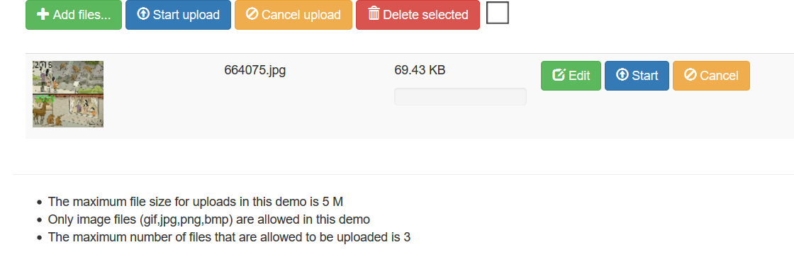

# Introduce
这个分支添加了token策略机制，用于抵御爬虫。当前分支中的功能和主分支的功能几乎是一样的。

# Enviroment
.net Core Version : .net Core 3.0

如果部署到Linux上，还需要从Docker上执行以下命令, [详情][1]
```
FROM microsoft/dotnet:2.1-aspnetcore-runtime AS base
RUN ln -s /lib/x86_64-linux-gnu/libdl.so.2 /lib/x86_64-linux-gnu/libdl.so
RUN apt update
RUN apt install -y libgdiplus
RUN ln -s /usr/lib/libgdiplus.so /lib/x86_64-linux-gnu/libgdiplus.so
```

# Key策略机制简述
1. 用户请求服务器，服务器启动token自动更新机制（默认是每隔10分钟生成一个新的token），并且返回给用户最新的token值。
2. 客户端拿着最新的token请求服务器，服务器验证token的有效性：
    * token正确：就下发给用户 **前端图片上传的js和h5脚本**， 客户端解析返回的js和h5脚本，并且展示到前端页面上
    * token验证失败：提示报错
3. 用户选择图片，编辑后，然后客户端携带着token开始上传图片，服务端验证token的有效性。
    * token正确： 就存储图片
    * token验证失败： 报错

# 安全问题
这个repository依然有很多的安全问题，这里列举几点问题和感想

1. 图片上传可以单独配置一台服务器（也可以考虑云图片服务器，比如阿里云，腾讯云，七牛云等等），和业务的服务器分开（即使图片服务器坍了，也不会影响服务器的正常工作）
2. 图片的地址应该记录在数据库，而且应该加一个**熔断机制**(比如：1分钟总共收30条上传数据，就可以停止图片上传的功能，过10分钟再启动。这里的时间间隔只是举例，可以按照实际业务来确定。)
3. 用户上传成功后，那个删除操作。也有可能是别人特意攻击的对象，可能会有人暴力循环尝试删除你服务器的所有图片数据。这里也可以加一个**熔断机制**（1分钟有30条删除操作，就停止删除功能）。 而且服务端也不要真实地删除图片，当有用户请求删除操作，服务端只需要把图片移动到服务器的一个客户端访问不到的位置（比如：当废弃的图片有500M时，就可调用压缩工具，自动压缩成一个压缩包，然后通知运维人员来查看这些图片）。 还有一种更简单的操作，就是不添加这个删除功能。
4. 还可以添加一个缓冲的机制，比如1分钟内上传了20条数据的时候，当前分钟内的其他的图片，在存储的时候，都可以按照原图片的70%的清晰度进行存储，减少图片存储的大小。（这里有一个缺点，就是万一有一些重要图片在70%的处理后，一些重要信息就看不清了，这就得不偿失了，所以这一点还需要根据实际的业务来取舍）。

# Screenshots

 


[1]:https://github.com/JanKallman/EPPlus/issues/83
